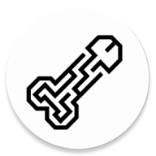

  
  <h1>RikkaHuy</h1>

RikkaHub 的个人分支，包含我需要的功能。🤖💬

[English](README.md) | [繁體中文](README_ZH_TW.md) | [Русский](README_RU.md) | 简体中文

## ✨ 本分支功能

-  **fal.ai 支持**
-  **Anthropic Claude 提示词缓存支持**
- 🛡️ **消息混淆** — 西里尔文↔拉丁文，不可见字符，同形异义词
- 🔇 **隐藏 TTS 按钮选项**
- 👆 **滑动删除聊天预览中的消息**
- 🐛 **错误修复**
  - 助手设置中滑块无法移动
  - 不支持斜体的字体上斜体文本无法渲染
  - 助手设置中的输入框存在延迟
  - 部分图片裁剪不正确

*列表将持续更新*

---

## 🚀 原项目

有关原项目的信息，请访问[原始仓库](https://github.com/rikkahub/rikkahub)。